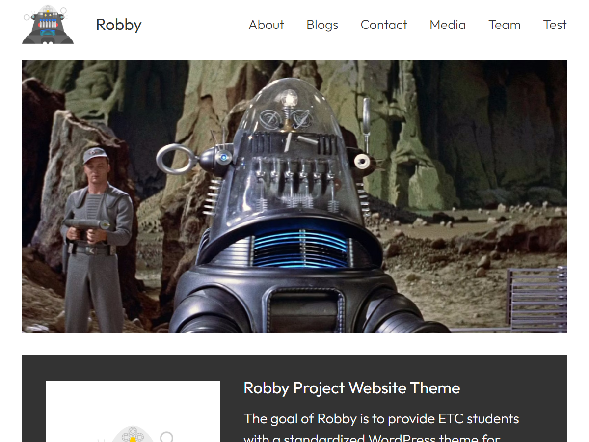

# Robby

A standardized WordPress theme for ETC Student Project Websites based on Frost them by WPEngine.

## About

TODO: UPDATE THE TEXT BELOW ONCE THE THEME IS FINALIZED

The Robby theme is derived from the Frost them, and includes a range of patterns including hero, testimonials, and call-to-action buttons.

## Requirements

- WordPress 6.4+
- PHP 7.0+
- License: [GNU General Public License v3](https://www.gnu.org/licenses/gpl-3.0.html)

## Getting Started

You can get the latest stable release of Robby from [GitHub](https://github.com/cmuetc/robby). Alternatively, install the entire repository for development purposes:

1. Set up a local WordPress development environment, we recommend using [Local](https://localwp.com/).
2. Ensure you are using WordPress 6.4+.
3. Clone / download this repository into the `/wp-content/themes/` directory of your new WordPress instance.
4. In the WordPress admin, use the Appearance > Themes screen to activate Robby.

## Resources

- [Frost website](https://frostwp.com/)
- [Set up a development environment with Local](https://localwp.com/)
- [How (and Why) to Build a Base WordPress Theme](https://www.youtube.com/watch?v=OUmx3IPyLOw)
